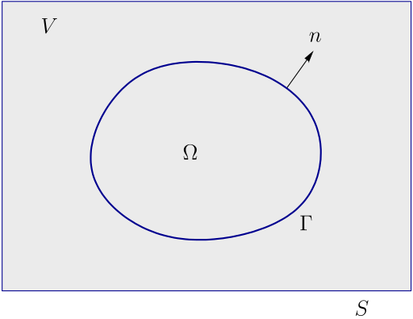

# Governing equations 

In this chapter we discuss the governing equations used throughout these lecture notes. As a starting point the three balance equations are derived for a single-component system. To complement these balances appropriate constitutive relations are needed as well as initial and boundary conditions to complete the mathematical formulation of the problem at hand. In the last part of this section special cases are considered resulting in the convection-diffusion and diffusion equations.

## Balance equations

### Balance of mass

Consider the closed system as schematically depicted in Figure {numref}`fig1-chap1`. The system under consideration contains a homogeneous fluid in a closed volume $V$ with boundary $S$. An arbitrary volume $\Omega \in V$ with boundary $\Gamma$ and outer normal $\vek n$ is defined. In such a system we can define the number of kilo moles as $n$, the molecular mass as  $M$, the mass as $m$ where  $m = nM$, the density as $ \rho = m/V $  and finally the velocity $ {\vek u} $.

```{figure-md} fig1-chap1


Homogeneous fluid in closed volume $\Omega$.
```

The mass within $\Omega$ is defined as

$$
 m = \int\limits_{\Omega} \rho d\Omega,
$$ (eq1-chap1)

and assuming that the system  is chemically inert (no mass production), the balance of mass simply states that there is no change of mass in time, i.e.

$$ \frac{dm}{dt} =  0, $$ (eq2-chap1)

however this form is not very useful. We prefer to have an equation in terms of density and velocity. So, the main question is how to take the derivative $\displaystyle \frac{d}{dt}$ of an integral where the domain limits are a function of time, i.e. $\Omega=\Omega(t)$? If the integrand limits were fixed we could simply bring the derivative through the integral operator and take the derivative of the integrand. However, in the general case the integral limits are a function of time and require treatment like that. The transport theorem of Reynolds provides means to deal with this. Consider the following definition of $\Phi$:

$$ \Phi = \int\limits_{\Omega(t)} \xi d\Omega, $$ (eq3-chap1)

where $\xi$ is a quantity defined per unit volume. The material derivative of $\Phi$ is then defined as

$$ \dot{\Phi}=\frac{d \Phi}{d t}  = \frac{d}{dt}\int\limits_{\Omega(t)} \xi d\Omega=
\int\limits_{\Omega(t)} ( \frac{d \xi}{dt}  + \xi  \nabla\cdot  {\vek u} ) d\Omega. $$ (eq4-chap1)

In general the material derivative of $\xi$ in Equation {eq}`eq4-chap1` can be written as the sum of a spatial derivative and convective derivative: 

$$ \frac{d \xi}{dt}=\frac{\partial \xi}{ \partial t} + {\vek u} \cdot \nabla \xi $$ (eq5-chap1)

such that an often used second form of the transport theorem of Reynolds yields

$$ \dot{\Phi} = \int\limits_{\Omega(t)} ( \frac{\partial \xi}{ \partial t}  + \nabla \cdot (\xi {\vek u} )) d\Omega. $$ (eq6-chap1)

Finally, with the Gauss divergence theorem, a third version of the transport theorem of Reynolds follows:

$$ \dot{\Phi} = \int\limits_{\Omega(t)} \frac{\partial \xi}{ \partial t}  d\Omega + \int\limits_{\Gamma(t)} \vek n \cdot \xi d  \Gamma, $$ (eq7-chap1)

which is perhaps the most well known version of the theorem. 
If we now substitute $\rho$ for $\xi$ we obtain

 $$ \int\limits_{\Omega(t)} \frac{\partial \rho}{ \partial t}  d\Omega + \int\limits_{\Gamma(t)} {\vek n} \cdot \rho d  \Gamma = 0, $$ (eq8-chap1)

 stating the change of mass in the volume should be equal to the flux of mass through the boundaries, or, in other words, we have balance of mass.  Similar, if we substitute $\rho$ for $\xi$ in Equation {eq}`eq4-chap1`, and again realize that the left hand side is equal to zero, the differential form of the balance of mass arises

$$ \frac{d \rho}{dt}  + \rho  \nabla \cdot  {\vek u} = 0, $$ (eq9-chap1)

since the integral relation must hold for any arbitrary volume, hence its argument should equal zero. Again using the relation between the material and spatial derivative from Equation {eq}`eq9-chap1`,

$$\frac{\partial \rho}{ \partial t} +   \nabla\cdot (\rho {\vek u}) = 0. $$ (eq10-chap1)

Finally, if the density is constant, then its time derivative equals zero and the incompressibility condition appears

$$ \nabla\cdot  {\vek u} = 0. $$ (eq11-chap1)


### Balance of momentum

Similar as the mass was defined, now the momentum ${\vek p}$ in domain $\Omega$ is defined:

$${\vek p} = \IO \rho {\vek u} d\Omega. $$ (eq12-chap1)

Balance of momentum implies that the change of momentum in $\Omega$ equals the total forces acting on the system. In general there are two kind of forces acting on the system, forces in the volume  i.e.

$$\IO {\vek f} d\Omega,$$ (eq13-chap1)

where ${\vek f}$ is a body force like gravity, but can also be an external magnetic or electrostatic force, and forces at the surface,

$$\IG {\vek t} d\Gamma$$ (eq14-chap1)

where ${\vek t}$ is a surface force acting on the boundary $\Gamma$ of the domain $\Omega$ and ${\vek t}$ is known as the stress vector as defined in

$${\vek t}  =  \ten \sigma \cdot \vek n, $$ (eq15-chap1)

where $\ten \sigma$ is the Cauchy stress tensor. Balance of momentum now states that the change of momentum equals the total force,

 $$ \frac{d{\vek p}}{dt} = \IO \rho{\vek f} d\Omega + \IG {\vek t} d\Gamma.$$ (eq16-chap1)

In the left hand side of the equation we again recognise that a material derivative is applied to an integral with limits that depend on time. Similar as in the derivation of the balance of mass we can apply the theorem of Reynolds, i.e.

$$ \frac{d{\vek p}}{dt} = \IO \pdif{\rho{\vek u}}{t} d\Omega + \IO \nabla \cdot (\rho{\vek u}{\vek u}) d\Omega. $$ (eq17-chap1)
 
If we now substitute Equation {eq}`eq17-chap1` in Equation {eq}`eq16-chap1`  an integral equation follows with all volume integrals except for the term including the traction ${\vek t}$. If we now note that substitution of Equation {eq}`eq15-chap1` in Equation {eq}`eq14-chap1` yields

 $$\IG {\vek t} d\Gamma = \IG \ten \sigma \cdot {\vek n} d\Gamma = \IO \nabla \cdot \ten \sigma^T  d\Omega,$$ (eq18-chap1)

where the divergence law of Gauss is used in the last step,
and we again use the reasoning that the domain $\Omega$ is arbitrary, it should hold the argument of the integral equals zero. Hence

 $$ \pdif{\rho{\vek u}}{t} + \nabla \cdot (\rho{\vek u}{\vek u}) =
  {\vek f} + \nabla \cdot \ten \sigma^T, $$ (eq20-chap1)

This equation can be simplified by applying the chain rule on the two terms of the left hand side yields

 $$\rho \pdif{{\vek u}}{t} + \underbrace{{\vek u} \pdif{\rho}{t} +
{\vek u}(\nabla \cdot \rho {\vek u})}_{={\vek 0}} + \rho{\vek u}\cdot(\nabla{\vek u}) =
 {\vek f} + \nabla\cdot \ten \sigma^T,$$ (eq21-chap1)

where the second and third term of the left hand side appear as the velocity times the balance of mass and thus

$$ \rho \pdif{{\vek u}}{t} + \rho({\vek u}\cdot\nabla){\vek u} =
 {\vek f} + \nabla \cdot \ten \sigma^T $$ (eq22-chap1)

Again note that using the relation between the material and spatial derivative an alternative form of the momentum balance reads:

$$ \rho \frac{d{\vek u}}{dt} =  {\vek f} + \nabla \cdot \ten \sigma.$$ (eq23-chap1)

### Balance of energy

The first law of thermodynamics for an *open system* $d\Omega$ states that the change in internal and kinetic energy should be equal to the total working power on the system. Mathematically, this is written as

$$  \frac{dU}{dt} + \frac{dK}{dt} = P+Q, $$ (eq24-chap1)

where

$$
\begin{array}{ll}
U &\mbox{internal energy}, \\
K& \mbox{kinetic energy}, \\
P& \mbox{power by external and contact forces, per unit of time}, \\
Q& \mbox{change in heat, per unit of time},
\end{array} $$

and similar as for the mass and momentum balance the individual terms are rewritten in terms of volume integrals.

* The first term considers the change of internal energy $U$ in the system where

  $$ U = \IO \rho u d\Omega, $$ (eq25-chap1)

  where $u$ is the *specific* internal energy.
  With the Reynolds transport theorem the material derivative of $U$ follows as

  $$ \frac{dU}{dt} = \IOt \pdif{\rho u}{t} d\Omega + \IOt \nabla \cdot(\rho u {\vek u}) d\Omega (eq26-chap1) $$

* The second term describes the rate of change in kinetic energy $K$ defined as

  $$ K= \IOt (\half \rho {\vek u}\cdot{\vek u}) d\Omega. $$ (eq27-chap1)

  With  Reynolds transport theorem

  $$ \frac{dK}{dt} = \frac{d}{dt} \IOt (\half \rho {\vek u}\cdot{\vek u}) d\Omega  =
  \IOt \pdif{}{t}(\half \rho {\vek u}\cdot{\vek u}) d\Omega +
  \IOt \nabla \cdot [(\half \rho {\vek u}\cdot{\vek u}) {\vek u} ] d\Omega. $$ (eq28-chap1)

* The third term is the mechanical working or power by external and contact forces:

  $$ P= \IOt  {\vek f}\cdot{\vek u} d\Omega + \IGt {\vek t}\cdot{\vek u} d\Gamma =
  \IOt  {\vek f}\cdot{\vek u} d\Omega + \IOt\nabla\cdot (\ten \sigma\cdot{\vek u}) d\Omega. $$ (eq29-chap1)

  Using the definition of the  rate of deformation tensor:

  $$ \ten D = \half(\ten L + \ten L^T) =
  \half( \nabla\vek u + (\nabla\vek u)^T ), $$ (eq30-chap1)

  and the tensor identity: $\nabla \cdot ( \ten \sigma \cdot {\vek u} ) = (\nabla \cdot \ten \sigma ) \cdot {\vek u} +
  \ten \sigma : (\nabla {\vek u})^T$
  we obtain:

  $$ P = \IOt  {\vek f}\cdot{\vek u} d\Omega +
  \IOt [{\vek u}\cdot ( \nabla \cdot \ten \sigma) + \ten \sigma :\ten D] d\Omega $$ (eq31-chap1)

* The final term defines heat working: 
  
  $$ Q = \IOt\rho r d\Omega - \IGt \vek q\cdot{\vek n} d\Gamma = \IOt\rho r d\Omega - \IOt \nabla \cdot \vek q d\Omega $$ (eq32-chap1)
  
  The minus sign in front of the heat flux term $\vek q$ appears, since the normal vector ${\vek n}$ is defined as the normal outward vector on $\Gamma$, thus the direction of the heat flux is opposite to that. The term $\rho r$ is relevant when radiation is important; for example when fluid flow inside a microwave is studied. Note that in most cases this term equals zero.

If all four terms are now substituted in Equation {eq}`eq24-chap1` and the argument is used that $\Omega$ is general, then the total integrand should also be zero, which yields the thermo-mechanical energy balance:

$$ \underbrace{\pdif{\rho u}{t} + \nabla\cdot (\rho u {\vek u})}_
     {\mbox{internal energy}} +
   \underbrace{\pdif{}{t} ( \half \rho {\vek u}\cdot{\vek u}) +
            \nabla \cdot [(\half \rho{\vek u}\cdot{\vek u}){\vek u} ]}_
     {\mbox{  kinetic energy}} $$ (eq33-chap1)
     

 $$ = \underbrace{ {\vek f}\cdot{\vek u} + [{\vek u}\cdot(\nabla\cdot\ten \sigma) + \ten \sigma : \ten D ]}_{\mbox{work by external and contact forces}}
+\underbrace{\rho r}_{\mbox{heat production}} - \underbrace{\nabla \cdot \vek q}_{\mbox{heat flux}} $$ (eq34-chap1)

The energy balance as given in
Equation {eq}`eq33-chap1` contains both thermal and mechanical terms and
substitution of mass and momentum balance yields after some algebra

$$ \rho \pdif{u}{t} + \rho {\vek u}\cdot\nabla u=\ten \sigma : \ten D+\rho r-\nabla\cdot\vek q $$ (eq35-chap1)

The three terms on  the right hand side denote energy contributed by either viscous dissipation, heat production and heat flux:

$$ \begin{array}{ll}
\mbox{viscous dissipation:} \quad & \ten \sigma : \ten D\\
\\
\mbox{heat production:} & \rho r\\
\\
\mbox{heat flux:} & \vek q\\
\end{array} $$

The three balance equations of mass, momentum and energy are now derived for a single component homogeneous system. These equation are in the most general form and could directly be applied to any problem at hand, if not for two main issues. First, no constitutive information is provided relating stresses to strains or how to define a heat flux and in terms of which physical quantity. The second related issue is that internal energy, albeit perfectly correct defined, is not a practical quantity to measure or define in any experiment. We much rather define a pressure or a temperature. In the next section we will derive the balance of entropy for a  single component homogeneous system, introduce temperature as a thermodynamic quantity, and finally come to the Onsager relation which provided guidelines how to define constitutive relations for stress $ \ten \sigma$ and heat flux $\vek q$.

### Energy equation with temperature
The thermal energy balance Equation {eq}`eq35-chap1` is still not straightforward to use  due the presence of internally energy as a variable. By defining that the internal energy can be written as a function of entropy and volume one can worked out an entropy balance to obtain guidelines how to define constitutive laws. In a similar way we can use this to replace internal energy in the energy balance with temperature. The details of this thermodynamic derivation go beyond the scope these lecture notes and the interested reader is referred to Groot and Mazur.

After some algebra Equation {eq}`eq35-chap1` can be rewritten in terms of temperature $T$ and pressure $p$ and this leads to

$$ \rho c_p \frac{dT}{dt} + \rho L_p \dot{p} =
\ten \sigma : \ten D - \nabla\cdot\vek q + \rho r, $$ (eq36-chap1)

where $c_p$ is the specific heat at constant pressure and $L_p$ is the latent heat of pressure. Note that this formulation is of particular use when we are dealing with fluids. In case of gasses an equivalent form can be derived reading

$$ \rho c_v \frac{dT}{dt} + \rho L_v \frac{d v }{dt} =
\ten \sigma : \ten D - \nabla\cdot\vek q + \rho r, $$ (eq37-chap1)

where $c_v$ is the specific heat at constant volume and the scalar $v$ denotes the specific volume where $v=\rho^{-1}$.

## Constitutive equations
The balance of mass, momentum and energy derived in the previous section are general and need to be completed with constitutive equations. The most simple constitutive relations for stress and heat flux are
* stress is linear proportional with rate of deformation (Newton's law): 

  $$\ten \tau=2\eta\ten D,$$ (eq38-chap1)

  where $\eta$ denotes the viscosity.

* heat flux is linear proportional with temperature gradient (Fourier's law): 

  $$\vek q=-\vek k\cdot\nabla T,$$ (eq39-chap1)

  where $\vek k$ denotes the thermal heat conduction, which can be a two-tensor in general.
These are the simplest constitutive formulations, but not all homogeneous materials obey these laws. Some materials show a time-dependence of stress on rate of deformation and/or a dependence of viscosity on pressure, temperature or rate of deformation. In the field of rheology a large class of  constitutive relations have been developed.

## Isothermal conditions

In flow problems the effect of temperature is often neglected and only the balance of mass and momentum are of importance. Therefore, we obtain for the linear momentum balance:

$$ \rho \derivmat{\vek u}t-\nao\cdot\ten \sigma^T = \vek f \qquad \text{in }\Omega $$ (eq40-chap1)

and for the angular momentum balance:

$$ \ten \sigma^T = \ten \sigma $$ (eq41-chap1)

From now on we omit “linear” and mean the linear momentum balance when we refer to the momentum balance.

<a name="Remark:1.1"></a>
```{admonition} Remark 1.1
:class: note

We have defined the stress tensor as a linear mapping from the normal vector $\vek n$ on the traction vector $\vek t$, i.e. $\vek t=\ten\sigma\cdot\vek n$. As a consequence, in most of the equations related to the momentum balance, the stress tensor $\ten\sigma$ appears with a transposed symbol. In most books on continuum mechanics, rheology etc., the authors try to get rid of the transposed symbol. There are several ways to do this. First, defining a divergence operator working on a tensor, such as $\divg \ten \sigma=\nao\cdot\ten\sigma^T$, is a possibility. Also, substituting the symmetry of the stress tensor Equation {eq}`eq41-chap1` is an option. Finally, an alternative definition of $\vek t=\ten\sigma^T\cdot\vek n=\vek n\cdot\ten\sigma$ is sometimes used. However, we find
none of them satisfactory and choose to keep the transposed symbol.
```

If we neglect inertia the momentum balance becomes:

$$ -\nao\cdot\ten\sigma^T=\vek f\qquad\text{in }\Omega $$ (eq42-chap1)

and the mass balance can be written as:

$$ \derivmat{\rho}t + \rho\nao\cdot\vek u = 0 \qquad \text{in }\Omega $$ (eq43-chap1)

In constitutive models for fluids the Cauchy stress tensor is usually split as follows

$$ \ten\sigma =-p\ten I+\ten \tau $$ (eq44-chap1)

with $p$ the pressure and $\ten\tau$ the extra-stress tensor. For a Newtonian fluid the extra-stress tensor $\ten\tau$ is linear with the rate-of-deformation tensor $\ten D$:

$$ \ten\tau =\lambda(\tr\ten D)\ten I+2\mu\ten D=\lambda(\nao\cdot\vek u)\ten I+\mu (\nao\vek u+(\nao\vek u)^T) $$ (eq45-chap1)

where $\lambda$ is a dilatational coefficient and $\mu$ the *viscosity*. The coefficient $\lambda$ is usually written as $\lambda=\kappa-\frac 23\mu$, with $\kappa$ the *dilatational viscosity*. For an ideal monoatomic gas 
$\kappa=0$ (see e.g. {cite}`Bird2002`).

````{exercise} Exercise 1.1
:label: ex:1.1


Show, that for a Newtonian fluid we have

$$ \ten\tau = \kappa (\tr\ten D)\ten I+2\mu\ten D' $$

with $\ten D'=\ten D-\frac13(\tr\ten D)\ten I$, the *deviatoric* part of the $\ten D$. Verify, that $\tr\ten D'=0$. 

````

For a compressible fluid the pressure $p$ needs to be specified by a constitutive model, usually a function of the density $\rho$ and temperature. For liquids it is often assumed that the flow is incompressible, i.e. the volume does not change (or equivalently the density is constant). This leads to the following reduced mass balance for an incompressible fluid (the continuity equation):

$$ \nao\cdot\vek u=0\qquad\text{in }\Omega $$ (eq46-chap1)

The incompressibility assumption is a constraint on the motion of the fluid and changes the nature of the pressure $p$ from a quantity depending on the local density and temperature (as given by a constitutive model) to a quantity (“a force”) imposing the constraint. In mathematical sense, the pressure $p$ has become a *Lagrange multiplier* and can only be determined by solving the whole problem set, including the boundary conditions. Assuming incompressibility, the first term in Equation {eq}`eq45-chap1` vanishes and the value of $\lambda$ becomes irrelevant:

$$ \ten\tau =2\mu\ten D = \mu (\nao\vek u+(\nao\vek u)^T) $$ (eq47-chap1)

Combining Equations {eq}`eq40-chap1`, {eq}`eq44-chap1` and {eq}`eq47-chap1` leads to the *Navier-Stokes equations* for incompressible fluids:

$$
\begin{align*}
\rho\derivmat{\vek u}t-\nao\cdot(2\mu\ten D)+\nao p &=\vek f&&\text{in }\Omega \\
\nao\cdot\vek u&=0&\qquad&\text{in }\Omega
\end{align*}
$$ (eq48-chap1)

For problems where the inertia can be neglected, we arrive at the *Stokes equations* for incompressible fluids:

$$
\begin{align*}
 -\nao\cdot(2\mu \ten D)+\nao p &=\vek f,&&\text{in }\Omega \\
\nao\cdot\vek u&=0&\qquad&\text{in }\Omega
\end{align*}
$$ (eq49-chap1)

````{exercise} Exercise 1.2
:label: ex:1.2


Show that

$$ \nao\cdot(2\ten D)=\nao\cdot(\nao\vek u+(\nao\vek u)^T)=\nabla^2\vek u $$ (eq50-chap1) 

for incompressible fluids.

````

If the viscosity $\mu$ is a constant in space 
we can, using Equation {eq}`eq50-chap1`, reduce the Navier-Stokes equations to the, so-called, Laplace form:

$$
\begin{align*}
\rho\derivmat{\vek u}t-\mu\nabla^2\vek u+\nao p &=\vek f&&\text{in }\Omega \\
\nao\cdot\vek u&=0&\qquad&\text{in }\Omega
\end{align*}
$$ (eq51-chap1)

and similarly for the Stokes equations:

$$
\begin{align*}
 -\mu\nabla^2\vek u+\nao p &=\vek f&&\text{in }\Omega \\
\nao\cdot\vek u&=0&\qquad&\text{in }\Omega
\end{align*}
$$ (eq52-chap1)

The Laplace-form is sometimes preferred because of special fast solvers {cite}`Elman2014` or easy discretization using finite-difference schemes. In these notes, we preferably use the original forms {eq}`eq48-chap1` and {eq}`eq49-chap1` (top equations) within the finite element context, because the extension to non-constant viscosity is trivial in that case.
Furthermore, it naturally leads to traction boundary conditions and as a result is much easier to use in flows with free surfaces and flows with multiple fluids each having different viscosities.

<a name="Remark:1.2"></a>
```{admonition} Remark 1.2
:class: note

  Functions will usually only be denoted by a symbol only, such $\vek u$ or $\ten\sigma$. The function arguments, such as position vector $\vek x$ and/or time $t$, will only be added when needed in the context of the presentation.
```

For 2D flows it can be quite instructive to plot streamlines, i.e. lines that are tangent to the velocity vector field $\vek u$ where time is frozen[^1]. In 2D, we use the *streamfunction* $\psi$, computed directly from
the velocity vector field $\vek u=u\vek e_1+v\vek e_2$. The definition of $\psi$ is

$$ \pderiv{\psi}{x} = -v,\qquad
   \pderiv{\psi}{y} = u $$

which shows that

$$ \psi(\vek x_2) - \psi(\vek x_1) = \int_{\Gamma_{12}}
      \vek n\cdot\vek u\, ds $$ (eq53-chap1)

or in words: the streamfunction difference is the flow rate through a curve
connecting two points. Equation {eq}`eq53-chap1` can be used to compute 
$\psi$ for any $\vek x$, but the procedure is cumbersome and not
straightforward. Therefore, we prefer a procedure that solves 
the Poisson equation

 $$ -\nabla^2\psi = \omega $$ (eq54-chap1)

with the vorticity $\omega=\plderiv vx-\plderiv uy$. We use a
Neumann boundary condition:

$$
 \begin{split}
   \pderiv{\psi}{n}=\vek n\cdot\nabla\psi=\vek n\cdot(-v\vek e_1+u\vek e_2)=
        -vn_1+un_2=-\vek u\cdot\vek t
 \end{split}
$$

where $\vek n=n_1\vek e_1+n_2\vek e_2$ is the outwardly directed unit normal vector and
$\vek t=-n_2\vek e_1+n_1\vek e_2$ is the tangential vector (with $\vek n\times\vek t=\vek e_3$).

## Summary of equations 

To summarize the equations for a homogeneous system, assuming Newtonian material behavior and Fourier heat flux the balance equations read:

- mass balance
    
    $$ \pdif{\rho}{t} + \nabla\cdot\rho{\vek u} = 0 $$
    
- momentum balance
    
    $$ \rho \pdif{{\vek u}}{t} + \rho({\vek u}\cdot\nabla){\vek u} = {\vek f} - \nabla p +
    \mu \nabla^2 {\vek u} $$
    
- energy balance
    
    $$ \rho c_p \pdif{T}{t} + \rho c_p  {\vek u}\cdot\nabla T +  \rho L_p \dot{p} = \ten \sigma : \ten D + \nabla\cdot (\vek k\cdot\nabla T) +\rho r $$
    
The balance equations need to be supplemented with initial and boundary conditions to describe any general homogeneous fluid flow problem. In only a very few, very simple cases analytical solutions are available and in general numerical methods are needed. Scaling of the equations can be very useful to determine which terms could be omitted for a specific flow problem and chapter 3 in the book "Modeling in Materials Processing" by {cite}`Dantzig2001` provided an excellent guideline *how* to scale the balance equations to obtain relevant dimensionless groups and find a much simpler set of equations which still has all the relevant physical terms in it (as simple as possible, but not too simple).


[^1]: Streamlines are *not* pathlines. Only if the velocity field is not dependent on time (steady), pathlines and streamlines are the same.


