(Chap6.1)=
# Moving material boundaries and interfaces

In the previous chapter we have considered problems having a fixed domain $\Omega$. In this chapter we extend this to domains where the boundaries move, and as a result the domain $\Omega$ changes as well. In general, the boundary position is unknown beforehand and *becomes part of the problem*. There can be all kind of physical reasons for the boundary to move, such as evaporation or condensation, however in this chapter we restrict it to the case of material displacement. In other words, we only consider *material boundaries*, where the boundary follows the material and no exchange of material is taking place with the “outside world”.

If a fluid consists of regions with different properties and/or phases and the transition between the regions can be considered to be very localized (sharp), we say there is a sharp interface between the fluid regions. These interfaces can move as well. Much like the material boundaries, we will only consider motion of the interfaces due to material displacement in this chapter[^1]. There will be no exchange of material across the interface.

The flows can be modelled by the (incompressible) Navier-Stokes equations, Equations {eq}`eq48-chap1`.
There is a wide range of applications for flows with moving material boundaries and interfaces, for example free surface flows, such as extrusion from a die, flow of polymer blends, foams, emulsions etc.

Since the position of the moving boundaries and/or interfaces is part of problem, we need an additional set of equations for this motion. In this chapter we will adopt an *explicit* description of the boundary/interface using a *boundary or interface mesh*.
In order to follow the boundary/interface, the mesh describing the domain needs to
adapt to the moving boundary/interface and we will assume a *boundary conforming mesh*, i.e. the boundary of the volume mesh will be identical to the boundary mesh. In general, the mesh motion will be different from the material motion. In order to solve the flow equation on a moving mesh, we adopt the arbitrary Lagrangian-Eulerian (ALE) formulation.

Furthermore, surface stresses (surface tension, surface viscosity and/or surface elasticity) can be present, which need special attention.


## Arbitrary Lagrangian-Eulerian formulation

If we have moving boundaries and/or interfaces, the mesh will change as a
function of time. The mesh can move independently from the material, i.e. we
use the so-called *arbitrary Lagrangian-Eulerian (ALE)* formulation. 

Let's start from the Eulerian or spatial description of a quantity $f$ (velocity, pressure, etc.):

$$
 f=\hat f(\vek x,t)
$$ (eq1-chap6)

where the arguments of the function $\hat f$ are the
(fixed) spatial coordinates (position vector) $\vek x$ and time $t$. If the domain $\Omega$ is changing in time, and a fixed grid is used to represent space, the boundary of the domain will not align with the element boundaries. This problem can be solved by introducing a moving curvilinear coordinate system given by

$$
   \vek x = \hat{\vek x}(\col{\xi},t)
$$ (eq2-chap6)

where $\col{\xi}=(\xi_1,\xi_2,\xi_3)$ are the curvilinear coordinates and
$\hat{\vek x}$ is the function that maps the coordinates $\col{\xi}$ onto the
spatial coordinates $\vek x$. Note, that the mapping is a function of time
(moving coordinates), but the values of $\col{\xi}$ are taken from a fixed (reference) domain $\Omega_\xi$ (see {numref}`fig1-chap6`). Also the mapping is taken such, that the boundaries of the reference domain $\Omega_\xi$ are mapped on the moving boundaries of the real domain $\Omega(t)$.

```{figure-md} fig1-chap6

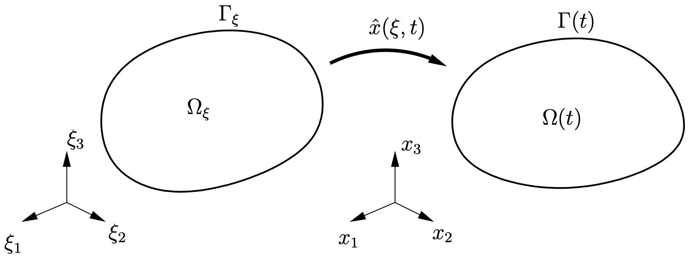

Fixed reference domain $\Omega_\xi$ with boundary $\Gamma_\xi$ mapped onto the real domain $\Omega(t)$ with boundary $\Gamma(t)$.
```

Now, we can find a new function
with $\col{\xi}$ as an argument to define the quantity $f$:

$$
f = \hat f(\vek x,t)
  = \hat f(\hat{\vek x}(\col{\xi},t),t)
  \equiv \bar f(\col{\xi},t)
$$ (eq3-chap6)

In the following we will call $\col{\xi}$ the grid coordinate system, or simply the
grid. In practise, the grid represents the moving mesh and the components of $\col{\xi}$ might be identified  on elementlevel with the reference coordinates of an element or with the coordinates of the mesh at a previous fixed time. However, any other (curvilinear) coordinate system will suffice, as long as all material points in the domain $\Omega(t)$ are represented by unique corresponding grid coordinates.

The mapping $\hat{\vek x}(\col{\xi},t)$ is quite general and only needs to be a one-to-one mapping (invertable) and the mapping of the boundary $\Gamma_\xi$ onto $\Gamma(t)$ needs to be such, that the part of boundary that is 
modeled as a material boundary, is tracked correctly.

Now, we can introduce the following two extreme cases:

1. The mapping function $\hat{\vek x}$ is independent of time. The grid is
“fixed” and basically we have an Eulerian formulation, where the grid is just
a curvilinear coordinate system to describe space. We can use any Cartesian coordinate system for $\col\xi$, if needed. The boundary cannot be a material boundary, except if a material boundary is fixed, like a wall. 
2. The grid coordinates $\col{\xi}$ move with the material. Thus each
material point can be identified with the unique coordinates $\col{\xi}$
(“material label”). This is called a Lagrangian formulation. The whole boundary $\Gamma$ is automatically a material boundary.

If the grid can move independently and tracks the material boundaries where needed, it is called an arbitrary Lagrangian-Eulerian (ALE) formulation. The ALE formulation helps to minimize mesh
distortion, while still being able to track material boundaries similar to a Lagrangian
formulation. For example, in the extrudate swell problem in {numref}`fig2-chap6` we start with a rectangular fluid domain. The material in the region after the exit of the die will flow upwards and downwards and the boundary will move. We want to track these material boundaries, but only in vertical direction. The inflow and outflow boundaries remain where they are, just like in the Eulerian formulation, except that the outflow boundary needs to extend up and down.

```{figure-md} fig2-chap6

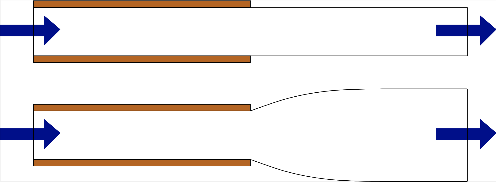

Extrudate swell.
```

We define the *grid time derivative* as follows

$$
   \pderiv{f}{t}\Big|_{\col{\xi}} = \pderiv{\bar f}{t}
$$ (eq4-chap6)

Hence, the grid time derivative describes the change in time of the quantity
$f$ as seen from a fixed grid point $\col{\xi}$. In order to find an expression
for the grid time derivative we differentiate Equation {eq}`eq3-chap6` in time
using the chain rule:

$$
   \pderiv{f}{t}\Big|_{\col{\xi}} = \pderiv{\hat f}{t}+\pderiv{\hat{\vek x}}{t}\cdot\nabla \hat f
$$ (eq5-chap6)

Here, the first term on the right-hand side is the local time derivative
(usually denoted by $\plderiv{f}{t}$), the first factor in the second term is
the grid (or $\underline{\textrm{m}}$esh) velocity:

$$
 \vek u_\text{m}=\pderiv{\hat{\vek x}}{t} 
$$ (eq6-chap6)

and the second factor is the spatial gradient of $f$. Therefore, we get

$$
   \pderiv{f}{t}\Big|_{\col{\xi}} = \pderiv{f}{t}+\vek u_\text{m}\cdot\nabla f
$$ (eq7-chap6)

For the special cases we get:

1. Eulerian formulation, $\vek u_\text{m}=\vek 0$:

   $$
   \pderiv{f}{t}\Big|_{\col{\xi}} = \pderiv{f}{t}
   $$ (eq8-chap6)

2. Lagrangian formulation, $\vek u_\text{m}=\vek u$ (velocity of the
fluid):

   $$
   \pderiv{f}{t}\Big|_{\col{\xi}} = \pderiv{f}{t}+\vek u\cdot\nabla f\equiv\dot f
   $$ (eq9-chap6)

   where $\dot f$ is the material (or substantial) derivative.  


Combining Equations {eq}`eq7-chap6` and {eq}`eq9-chap6` gives

$$
    \dot f=\pderiv{f}{t}\Big|_{\col{\xi}} + (\vek u-\vek u_\text{m})\cdot\nabla f
$$ (eq10-chap6)

which is quite useful for transforming the physical equations into a suitable
form for implementation with the ALE formulation.


````{exercise}
:label: ex:6.1

Consider the extrudate problem of {numref}`fig2-chap6`. Starting from the straight extrudate, the fluid will move up and down and the mapping $\hat{\vek x}(\col{\xi},t)$ will follow this motion. Is the grid/mesh velocity divergence free, i.e. is $\nao\cdot\vek u_\text{m}=0$?
````


## Material boundary tracking

The ALE mapping, given by Equation {eq}`eq2-chap6`, reduced to the surface $\Gamma(t)$ describes the motion of the boundary. For simplicity (but not less general!), we assume the surface is given by $\xi_3=\text{constant}$ and can be described by the mapping of a 2D reference domain onto a 3D surface (see {numref}`fig3-chap6`):

$$
   \vek x = \hat{\vek x}(\col{\xi},t)
$$ (eq11-chap6)

where $\col\xi=(\xi_1,\xi_2)$ are the curvilinear coordinates and
$\hat{\vek x}$ is the function that maps the coordinates $\col\xi$ onto the
spatial coordinates $\vek x$ of the surface. Note, that the mapping is a function of time
(moving coordinates), but the values of $\col\xi$ are taken from a 2D fixed (reference) domain $\Omega_\xi$ (see {numref}`fig3-chap6`). For 2D flows, only one coordinate $\xi$ is needed, and the mapping is from a fixed 1D domain for $\xi$ to a curve in 2D.

```{figure-md} fig3-chap6

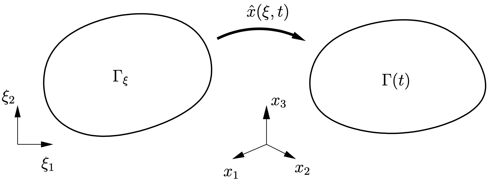

Fixed 2D reference domain $\Gamma_\xi$ mapped onto the real surface $\Gamma(t)$ in 3D.
```

For material boundaries, the surface must follow the envelop of the material particles on the boundary. This means, that in the direction normal to the boundary the grid velocity $\vek u_\text{m}$, given by Equation {eq}`eq6-chap6`, must be equal to the velocity of the material $\vek u$:

$$
 \vek u_\text{m}\cdot\vek n = \vek u\cdot\vek n 
$$ (eq12-chap6)

where $\vek n$ is normal vector on the surface. Splitting the grid velocity $\vek u_\text{m}$ on the surface into a normal and a tangential part (see {numref}`fig4-chap6`):

$$
  \vek u_\text{m}=\vek u_\text{m,n}+\vek u_\text{m,t}
$$ (eq13-chap6)

we find, according to Equation {eq}`eq12-chap6`, that the 
normal velocity of the grid can be written as:

$$
  \vek u_\text{m,n}=(\vek u\cdot\vek n)\vek n
$$ (eq14-chap6)

The tangential velocity of the grid $\vek u_\text{m,t}$ can be chosen freely. The equation for tracking the material boundary becomes

$$
  \pderiv{\vek x}t\Big|_{\col\xi}=(\vek u\cdot\vek n)\vek n+\vek u_\text{m,t}
$$ (eq15-chap6)

````{exercise}
:label: ex:6.2

Show, that the tangential grid velocity can be written as

$$
  \vek u_\text{m,t}=\ten P(\vek n)\cdot \vek u_\text{m}
$$ (eq16-chap6)

where $\ten P(\vek n)=(\ten I-\vek n\vek n)$ is the projection operator.

````

```{figure-md} fig4-chap6

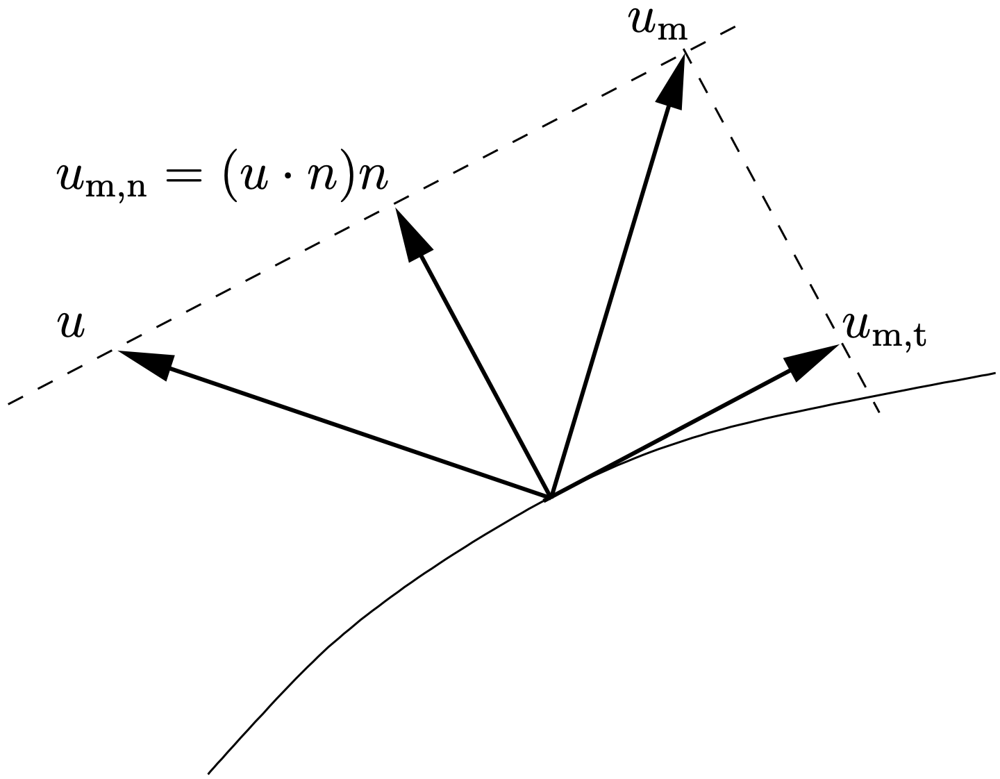

For a material surface, the grid velocity $\vek u_\text{m}$ and the fluid velocity $\vek u$ must be equal in normal direction. The tangential grid velocity  $\vek u_\text{m,t}$ can chosen freely.
```

Two extreme cases are

1. $\vek u_\text{m,t}=\ten P(\vek n)\cdot \vek u$, and get

    $$
    \pderiv{\vek x}t\Big|_{\col{\xi}}=\vek u
    $$ (eq17-chap6)

    The surface moves in a *Lagrangian* way.
2.  $\vek u_\text{m,t}=\vek 0$, and get

    $$
    §\pderiv{\vek x}t\Big|_{\col{\xi}}=(\vek u\cdot\vek n)\vek n
    $$ (eq18-chap6)

    The surface moves in normal direction only.

````{exercise}
:label: ex:6.3

Assume a planar elongational flow:

$$
 \vek u=\dot\epsilon(\vek e_1-\vek e_2),\qquad \dot\epsilon>0
$$ (eq19-chap6)

and consider a material boundary of circular shape, initially. During deformation the circle will be deformed and  the shape becomes elliptical with the major axis in $x_1$-direction and the minor axis in $x_2$-direction. The initial circle is “meshed“ using elements of equal size. Where is the highest concentration of nodes of the mesh when using a 1. Lagrangian motion of the boundary, 2. motion normal to the boundary only? 

````

Solving the vector equation {eq}`eq15-chap6` in time for obtaining the boundary motion, is beyond the scope of these lecture notes. For many problems, the height function approach, where only a scalar equation needs to be solved, is simpler and quite sufficient. This will be the topic of the next section.


## The height function approach to material boundary tracking

Consider the 2D extrudate swell flow in {numref}`fig5-chap6` and we want to track the upper boundary in the downstream part. As shown in the figure, we can introduce a 1D height function $y=h(x,t)$ to described the upper boundary. The lower boundary can be handled similarly. The $x$-coordinate basically acts as the reference coordinate $\xi$ of the mapping function, i.e. 

$$
\vek x=\hat{\vek x}(x,t)=x\vek e_x+h(x,t)\vek e_y
$$ (eq20-chap6)

Using this choice for the motion of the boundary, the mesh velocity (on the boundary) is directed in $y$-direction:

$$
   \vek u_\text{m}=\pderiv{\hat{\vek x}}t=\pderiv{h}t\vek e_y 
$$ (eq21-chap6)

The normal vector $\vek n$ is given by

$$
   \vek n = \frac1{\sqrt{1+(\pderiv{h}{x})^2}}(-\pderiv{h}{x}\vek e_x+\vek e_y) 
$$ (eq22-chap6)

```{figure-md} fig5-chap6


Tracking the material boundary using a height function $h(x,t)$.
```

````{exercise}
:label: ex:6.4

Derive Equation {eq}`eq22-chap6`. Hint: first derive the tangential vector using $\plderiv{\hat{\vek x}}{x}$.

````

Substituting Equation {eq}`eq21-chap6`-{eq}`eq22-chap6` into Equation {eq}`eq12-chap6` and using $\vek u=u_x\vek e_x+u_y\vek e_y$, we find that

$$
  \pderiv{h}{t}+u_x\pderiv{h}x=u_y 
$$ (eq23-chap6)

where $u_x$ and $u_y$ need to be evaluated at the boundary. Equation {eq}`eq23-chap6` is a time-dependent *convection equation* for the height function $h(x,t)$. The initial and boundary conditions are

$$
 h(x,t=0)=H,\qquad h(x=0,t)=H
$$ (eq24-chap6)

````{exercise}
:label: ex:6.5

 Show that the component in tangential direction of the grid velocity $\vek u_\text{m}$, is given by

$$
  \vek u_\text{m}\cdot\vek t=\vek u\cdot\vek t-u_x\sqrt{1+\big(\pderiv{h}{x}\big)^2}
$$ (eq25-chap6)

````

````{exercise}
:label: ex:6.6

 Show that for a material surface in 3D described by a height function $z=h(x,y,t)$, $h$ fulfills the PDE:

$$
  \pderiv{h}{t}+u_x\pderiv{h}x+u_y\pderiv{h}y=u_z 
$$ (eq26-chap6)

````

Once the position of the surface is known, the ALE mapping Equation {eq}`eq2-chap6` of the domain needs to be defined. For the extrudate problem (see {numref}`fig5-chap6`) we map the downstream part from the undeformed rectangular domain $(x_0,y_0)\in [0,L]\times[0,H]$, where $(x_0,y_0)$ are the reference coordinates, to the deformed domain as follows:

$$
 \vek x=x_0\vek e_x+h(x_0,t)\frac{y_0}H\vek e_y
$$ (eq27-chap6)

i.e. all $y$-coordinates are stretched proportional to the original $y$-position $y_0$.

## Discretization in space

The height function equation Equation {eq}`eq23-chap6` is a convection equation in 1D. We use the finite element method for discretization in space. The Galerkin method is not very suitable for solving convection equations and usually stabilization is needed. We apply SUPG stabilization (Streamline Upwind Petrov Galerkin) {cite}`Donea2003` here. The details of SUPG stabilization are beyond the scope of these lecture notes.

(Chap6.5)=
## A decoupled scheme

Assume we have a Newtonian fluid where inertia can be neglected, i.e. the flow can be described by the Stokes equations {eq}`eq2-chap3` with boundary conditions {eq}`eq3-chap3`. On (a part of) the Neumann boundary, we assume a material boundary of the domain.
The domain is a function of time $\Omega(t)$ and the motion of the material boundary can be described by a height function $h(x,t)$ obeying Equation {eq}`eq23-chap6`. For solving the Stokes equations for velocity $\vek u(\vek x,t)$ and pressure $p(\vek x,t)$ we need the domain and thus the height function $h(x,t)$ to be known, whereas for solving the height function equation we need the velocity to be known on the material boundary. So the equations are coupled and are best solved at the same time. Since the coupling is quite complicated, we propose a decoupled approach. 

Since the equation for the height function Equation {eq}`eq23-chap6` is a time-dependent equation, we need to apply a time-discretization. For that, we define the time points $t_n$, $n=0,1,2,\dots$ with $t_0=0$, $t_{n+1}>t_n$ (see {numref}`fig7-chap5`). The difference between the time points, the \emph{time steps} $\Delta t_n=t_{n+1}-t_n$, $n=0,1,2,\dots$ do not have to be same, but here we will only consider a constant time step, i.e. $\Delta t_n=\Delta t$ for all $n$. In that case, we have $t_n=n\Delta t$. As in {numref}`Chap5.5`, the field values at $t_n$ are denoted by a subscript $n$, for example $h_n$, $\vek u_n$, $p_n$.

First, we discuss first-order in time time-stepping and then extend it to second-order.

### First-order scheme

Assume all quantities are known at $t_n$ and we want to do one time step to $t_{n+1}$.
To be first-order accurate in time, all terms in the equations and also the coordinates of the domain (mesh), need to be accurate up to $\mathcal{O}(\Delta t)$. Since, the difference in mesh positions between $t_n$ and $t_{n+1}$ is $\mathcal{O}(\Delta t)$, it is allowed to solve the velocity field and pressure field $\vek u_{n+1}$, $p_{n+1}$ from the Stokes equation on the domain $\Omega_n=\Omega(t_n)$, i.e. using the known mesh positions at $t_n$. Once we know
$\vek u_{n+1}$, we can compute $h_{n+1}$ using a backwards Euler method: 

$$
  \frac{h_{n+1}-h_n}{\Delta t}+u_{x,n+1}\pderiv{h_{n+1}}x=u_{y,n+1} 
$$ (eq28-chap6)

Using Equation {eq}`eq27-chap6` the full mesh position at $t_{n+1}$ can be computed.

### Second-order scheme

Assume all quantities are known at $t_{n-1}$, $t_n$ and we want to do one time step to $t_{n+1}$. To be second-order accurate in time, all terms in the equations and also the coordinates of the domain (mesh), need to be accurate up to $\mathcal{O}(\Delta t^2)$. We can achieve that for the mesh coordinates by using a \emph{second-order prediction}. For that, we use a second-order prediction $h^*_{n+1}$ for $h_{n+1}$ using:

$$
   h^*_{n+1} = 2h_n-h_{n-1} 
$$ (eq29-chap6)

and then Equation {eq}`eq27-chap6` with $h^*_{n+1}$ to find the prediction of the mesh coordinates at $t_{n+1}$.

````{exercise}
:label: ex:6.7

Show, that $h^*_{n+1}$ in Equation {eq}`eq29-chap6` introduces a $\mathcal{O}(\Delta t^2)$ error, assuming $h_n$ and $h_{n-1}$ are itself at least $\mathcal{O}(\Delta t^2)$ accurate.
````

Using the predicted mesh at $t_{n+1}$ the velocity field and pressure field $\vek u_{n+1}$, $p_{n+1}$ are obtained from the Stokes equation on the (predicted) domain $\Omega^*_{n+1}$. Once we know
$\vek u_{n+1}$, we can compute a corrected $h_{n+1}$ using a second-order backward differencing method (BDF2): 

$$
  \frac{\frac32h_{n+1}-2h_n+\frac12h_{n-1}}{\Delta t}+u_{x,n+1}\pderiv{h_{n+1}}x=u_{y,n+1} 
$$ (eq30-chap6)

Using Equation {eq}`eq27-chap6`  the full mesh position at $t_{n+1}$ can be computed.

````{exercise}
:label: ex:6.8

Why do we need a correction and cannot use the prediction only?

````

## Surface tension

Surface stress is the phenomenon that forces/stresses are created at the
boundary of the material. The forces are directed in the plane of the boundary,
as if it is a virtual membrane with a planar stress state. For the simplest
case, the stress state is isotropic, and given by a single value $\sigma$, the
surface tension (coefficient). The surface tension $\sigma$ can be/is a function of temperature and possibly surfactant concentration on the boundary, but usually not a direct function of the area deformation. 

The surface tension affects the traction the fluid “feels“. In {numref}`fig6-chap6` we have depicted a part of the Neumann boundary $\Gamma_\text{N}$ for a 2D flow, and a zoom of an infinitesimal part of the boundary $ds$. The boundary has been separated from the bulk fluid in $\Omega$. This small part of the boundary must be in equilibrium, i.e.

$$
  -\ten \sigma\cdot\vek n\,ds+\vek t_\text{N}\,ds + \sigma \vek t|_{s+ds} -
\sigma \vek t|_{s}=\vek 0
$$ (eq31-chap6)

or

$$
  \ten \sigma\cdot\vek n=\vek t_\text{N} + \deriv{}{s}(\sigma \vek t) 
$$ (eq32-chap6)

Hence, the surface tension leads to a difference between the imposed traction $\vek t_\text{N}$ and the traction on the fluid $\ten\sigma\cdot\vek n$.

```{figure-md} fig6-chap6

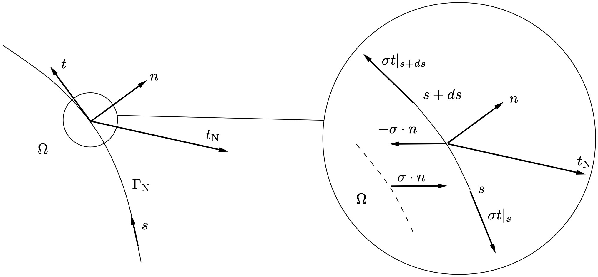

Left: part of the Neumann boundary $\Gamma_\text{N}$, described by the arc length $s$, with the domain $\Omega$ on the left side. Also defined are the unit tangential vector $\vek t$, outwardly directed unit normal vector $\vek n$ and imposed traction vector $\vek t_\text{N}$. Right: zoom of an infinitesimally small part of the boundary $ds$, where the boundary has been separated from the bulk fluid.
```

````{exercise}
:label: ex:6.9

 Argue, that Equation {eq}`eq32-chap6` does not depend on the positive direction of $s$.
````

````{exercise}
:label: ex:6.10

Show that

$$
 \deriv{}{s}(\sigma \vek t)=\deriv{\sigma}s\vek t-\kappa\sigma\vek n
$$ (eq33-chap6)

where $\kappa=1/R$ is the curvature (see {ref}`Appendix`). The
first term is the Maragoni stress and the factor $\kappa\sigma$ of the second term is the (2D) Laplace pressure.

````

The expression for the traction on the fluid Equation {eq}`eq32-chap6` leads to an additional term in the right-hand side of the weak form Equation {eq}`eq9-chap3`, which for 2D flows after partial integration on the curve, becomes

$$
  \int_{\Gamma_{\text{N}}}\vek v\cdot \deriv{}{s}(\sigma \vek t)\, ds=
    -\int_{\Gamma_{\text{N}}}\deriv{\vek v}{s}\cdot \sigma \vek t\, ds+[\vek
v\cdot\sigma \vek t]_{s_1}^{s_2}
$$ (eq34-chap6)

where $s_1$ and $s_2$ are the start and the end of the curve. The last term(s) only appear if the Neumann boundary
is open (not closed) and the end points are not Dirichlet (since $\vek v=\vek 0$ for Dirichlet boundaries).

````{exercise}
:label: ex:6.11

Is partial integration really needed?

````

````{exercise}
:label: ex:6.12

Does the additional term of the weak form given in Equation {eq}`eq34-chap6` after partial integration include the effect of the Marangoni stresses, i.e. $\lderiv{\sigma}s\neq0$, or does it only work for constant $\sigma$?

````

In the decoupled scheme of {numref}`Chap6.5` the weak form Equation {eq}`eq34-chap6` needs to be evaluated at $t_{n+1}$. We use the position of the predicted boundary $\Gamma^*_{n+1}$ (of the domain $\Omega^*_{n+1}$) to compute the geometry dependent quantities, such as $\vek t$. Substituting Equation {eq}`eq16-chap3` for the discretized test space $\vek v_h$, we get 

$$
    \sum_{k=1}^{N_u} \vek v_k\cdot
\left(-\int_{\Gamma_{\text{N}}}\deriv{\phi_k(\vek x)}{s}\sigma \vek t\,
ds+[\phi_k(\vek x)\sigma \vek t]_{s_1}^{s_2}\right)
$$ (eq35-chap6)

for the discretized weak form and

$$
     -\int_{\Gamma_{\text{N}}}\deriv{\phi_k(\vek x)}{s}\sigma \vek t\,
ds+[\phi_k(\vek x)\sigma \vek t]_{s_1}^{s_2}
$$ (eq36-chap6)

as an additional contribution to the right-hand side of Equation {eq}`eq23-chap3` (first equation).

````{exercise}
:label: ex:6.13
 
Show that Equation {eq}`eq36-chap6` only contributes to the nodes $k$ that are positioned on the boundary $\Gamma_\text{N}$. Assume the Kronecker delta property, i.e. $\phi_k(\vek x_m)=\delta_{km}$.

````

````{exercise}
:label: ex:6.14

 Assume, that the basis functions $\phi_k$ are defined by mapping polynomials on a reference element to the real element. The reference coordinates are $\col \xi=(\xi_1,\xi_2)$, $i=1,2$, thus $\phi_k(\col\xi)$. Furthermore, assume that isoparametric elements are used, i.e. the shape of an element is given by mapping the same basis functions from the reference coordinates:

$$
  \vek x=\sum_{k=1}^{N_u}\vek x_k\phi_k(\col{\xi})
$$ (eq37-chap6)

Show that the first term in Equation {eq}`eq36-chap6` can be written as:

$$
  -\int_{\Gamma_{\text{N}}}\deriv{\phi_k(\vek x)}{s}\sigma \vek t\, ds=-\sum_{m=1}^{N_u}\int_{\Gamma_{\text{N}}}\mat{S_{km}}\vek x_m
$$ (eq38-chap6)

with the matrix $[\mat{S_{km}}]$ defined as

$$
  \mat{S_{km}}=\sum_{m=1}^{N_u}\int_{\Gamma_{\text{N}}}\deriv{\phi_k(\vek
x)}{s}\sigma \deriv{\phi_m(\vek x)}s\, ds
$$ (eq39-chap6)

How would you characterize this matrix?

````

## Examples

`````{admonition} Extrudate swell
:class: examp 


```{figure-md} fig1-chap7

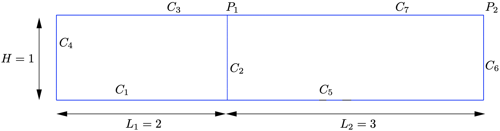

Curves and points for defining the extrudate swell problem.
```

We first solve the following flow problem using the Stokes equations ($\mu=1$) and the height function approach (see Figure~\ref{fig:curves_extrudate_swell}), excluding surface tension:

1. On curves $C_1$ and $C_5$ symmetry conditions are applied, i.e. $t_x=0$, $u_y=0$.
2. On curve $C_3$ we have a fixed wall: $\vek u=\vek 0$.
3. On curve $C_4$ (inflow), we set $u_y=0$ and $t_x(y,t)=P(t)$, where $P(t)$ is such that the average velocity:     
   
   $$
      U=\frac1H\int_{0}^Hu_x(y)\,dy = 1
   $$ (eq40-chap6)

   i.e. constant in time with a value of 1.
4. On the $C_6$ (outflow) we set $u_y=0$ and $t_x=0$.
5. The curve $C_7$ is a `free surface', where $\vek t=\vek 0$.
6. We use a mesh, where on the entry part of the domain we have $25\times25$ elements and on the exit part $50\times25$ elements. The distribution is such that elements are refined by a factor of 30 in $y$-direction near the wall and free surface and also refined by a factor of 30 in $x$-direction towards the exit point $P_1$.
7. We use Taylor-Hood $Q_2$-$Q_1$ elements (see {numref{fig13-chap3}}) for the flow problem.
8. The height function problem is solved on a 1D mesh extracted from the $x$-coordinates of the surface mesh between the point $P_1$ and $P_2$ (curve $C_7$). The height function at point $P_1$ is set to $H$ using a Dirichlet condition ($h(x=0,t)=H$). The initial value is $h(x,t=0)=H$, i.e. the initial exit domain is a rectangle. Discretization is done using $P_2$ elements compatible with the velocity field $\vek u$.
9. We use a second-order in time decoupled scheme with a time step $\Delta t=0.05$.

In {numref}`fig8-chap6` we show the height function $h(x,t)$ as a function of time. We see that the extrudate swells and starting from the point $x=0$ it becomes steady. The unsteady part leaves the domain and for approximately $t>4$, the profile is steady within the considered domain. The final swell height is $\approx1.1888H$.

```{figure-md} fig8-chap6

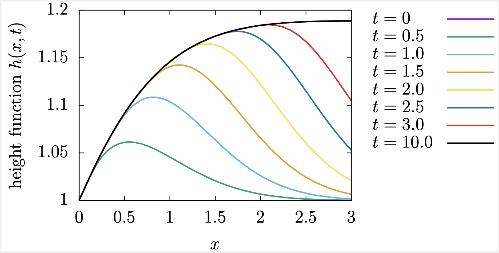

Height function $h(x,t)$ for the extrudate swell problem.
```

In {numref}`fig9-chap6`-{numref}`fig12-chap6` we show the deformation of the mesh for three different time points. We clearly see that the vertical position of the nodes in the downstream section move proportional to the height of the surface.

```{figure-md} fig9-chap6

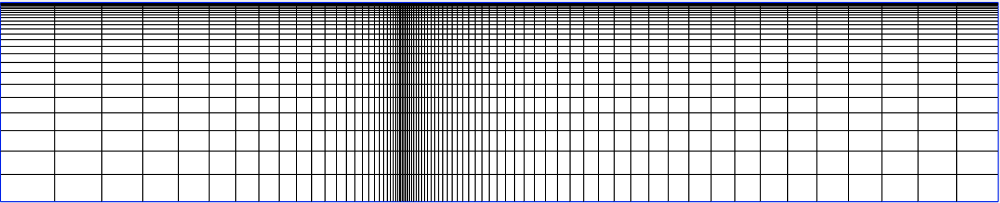

Mesh as a function of time for the extrudate swell problem. Time $t=0$.
```

```{figure-md} fig10-chap6

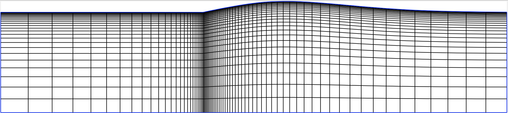

Mesh as a function of time for the extrudate swell problem. Time $t=1$.
```

```{figure-md} fig11-chap6

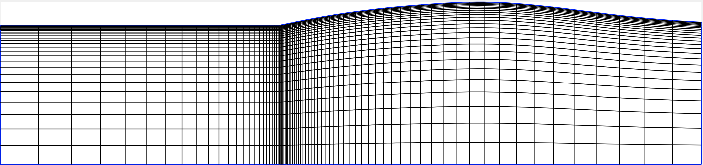

Mesh as a function of time for the extrudate swell problem. Time $t=2$.
```

```{figure-md} fig12-chap6

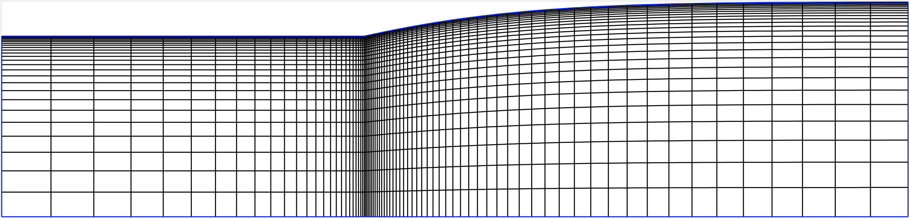

Mesh as a function of time for the extrudate swell problem. Time $t=5$.
```

In {numref}`fig13-chap6`-{numref}`fig16-chap6` we show the streamfunction for three different time points. Note, that in the transient part, some streamlines end on the surface. Also note, that the growth of the swell seems to come from the fluid flowing just under the fixed wall, whereas the bulk flow is almost steady from $t=0$.

```{figure-md} fig13-chap6

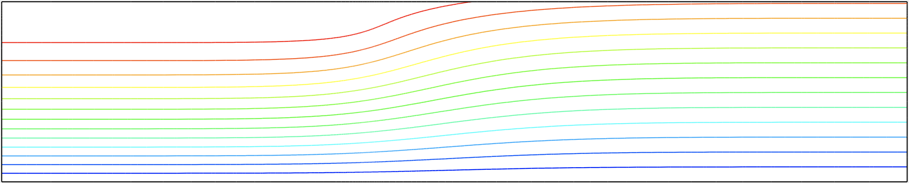

Streamfunction as a function of time for the extrudate swell problem. Time $t=0$.
```

```{figure-md} fig14-chap6

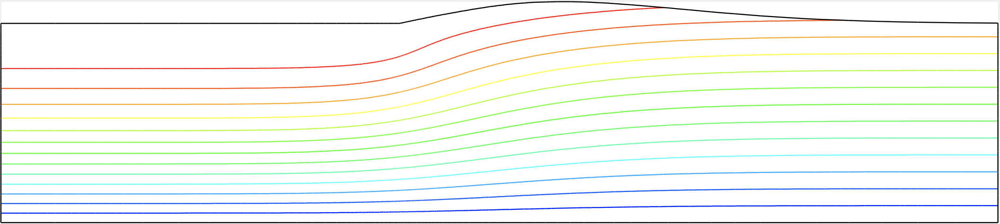

Streamfunction as a function of time for the extrudate swell problem. Time $t=1$.
```

```{figure-md} fig15-chap6

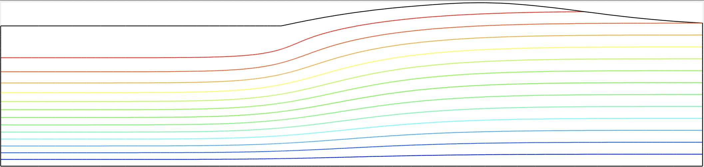

Streamfunction as a function of time for the extrudate swell problem. Time $t=2$.
```

```{figure-md} fig16-chap6


Streamfunction as a function of time for the extrudate swell problem. Time $t=5$.
```

Next, we solve the same problem, but now including surface tension. We only consider one case, i.e. $\sigma=1$, which gives a Capillary number of $\mathit{Ca}=\mu U/\sigma=1$. Since the surface tension force is not taken implicitly, the time step needs to be reduced to $\Delta t=0.002$. This is not unexpected, since the  distance $\Delta x$ of the first nodal point on the boundary to the right of point $P_1$ is $\Delta x\approx3.46\cdot10^{-3}$ giving a characteristic mesh time scale of $\Delta x\mu/{\sigma}\approx3.46\cdot10^{-3}$. In {numref}`fig17-chap6` we show the height function $h(x,t)$ as a function of time. We see that the extrudate swells, but compared to the case without surface tension, the swelling is delayed in the whole swelling region. The nature of the formation of the swell profile is also changed: it becomes steady gradually in time, like a diffusion process, whereas without surface tension it is like a convection process sweeping through the domain. The profile becomes steady within the considered domain for roughly $t>8$. The final swell height is $\approx1.1293H$, smaller than the case without surface tension.

```{figure-md} fig17-chap6

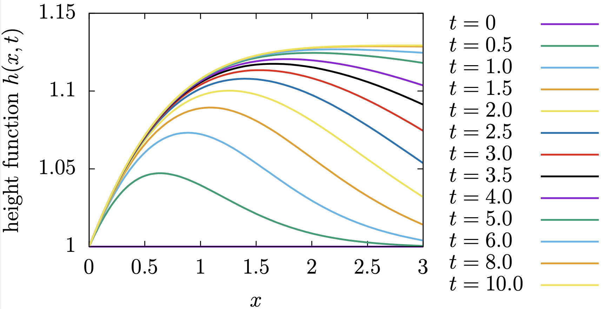

Height function $h(x,t)$ for the extrudate swell problem with
surface tension $\sigma=1$.
```

`````

`````{admonition} Spinning
:class: examp 

This problem represents the spinning of a thin thread by pulling the fluid from a die. It is quite similar to the extrudate problem, except that

1. The flow is axisymmetric.
2. The downstream zero traction boundary condition in horizontal direction is replaced by a (constant) velocity.
3. The entry and exit sections are much longer.

We consider the problem in a cylindrical coordinate system $(r,\theta,z)$. We assume axisymmetry, which means that $u_r$, $u_\theta$, $u_z$ and $p$ are independent from $\theta$ (rotational symmetry). We assume also $u_\theta=0$ (no swirl). To keep the cyclic order of the coordinates, we write the unknown fields as a function of $(z,r)$, i.e. the first axis is $z$. To evaluate the discretized 
weak form Equations {eq}`eq19-chap3` for axisymmetry we use 

$$
\begin{align*}
  \nao \vek u &= \nao \vek u|_\text{2D}+\frac{u_r}{r}\vek e_\theta\vek e_\theta\\
   \nao\cdot\vek u &= \nao\cdot\vek u|_\text{2D}+\frac{u_r}{r}\\
  u_r(z,r=0)&=0 \\
  \lim_{r\rightarrow0}\frac{u_r}{r}&=\pderiv{u_r}{r}(r=0,z)\\
  d\Omega &= 2\pi r drdz
\end{align*}
$$ (eq41-chap6)

where $\nao \vek u|_\text{2D}$ and $ \nao\cdot\vek u|_\text{2D}$ are the velocity gradient and divergence of the velocity evaluated “as if it were a 2D flow”.


```{figure-md} fig18-chap6

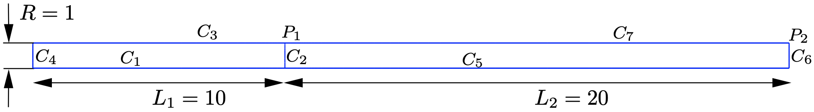

Curves and points for defining the spinning problem.
```

We solve the following spinning problem using the Stokes equations ($\mu=1$) and the height function approach (see {numref}`fig18-chap6`):

1. Surface tension $\sigma=0$,
2. On curves $C_1$ and $C_5$ symmetry conditions are applied, i.e. $u_r=0$.
3. On curve $C_3$ we have a fixed wall: $\vek u=\vek 0$.
4. On curve $C_4$ (inflow), we set $u_r=0$ and $t_z(y,t)=P(t)$, where $P(t)$ is such that the average velocity:
   $$
   U=\frac1{\pi R^2}\int_{0}^R u_z(r)2\pi r\,dr = 1
   $$ (eq42-chap6)
   i.e. constant in time with a value of 1.
5. On the $C_6$ (outflow) we set $u_z=\DR\, U$ with $\DR$ the *draw ratio* and $u_r=0$. 
6. The curve $C_7$ is a `free surface', where $\vek t=\vek 0$.
7. We use a mesh, where on the entry part of the domain we have $25\times15$ elements and on the exit part $50\times15$ elements. The distribution is such that elements are refined by a factor of 30 in $r$-direction near the wall and free surface and also refined by a factor of 30 in $z$-direction towards the exit point $P_1$.
8. We use Taylor-Hood $Q_2$-$Q_1$ elements (see {numref}`fig13-chap3`) for the flow problem.
9. The height function problem is solved on a 1D mesh extracted from the $z$-coordinates of the surface mesh between the point $P_1$ and $P_2$ (curve $C_7$). The height function at point $P_1$ is set to $R$ using a Dirichlet condition ($h(x=0,t)=R$). The initial value is $h(x,t=0)=R$, i.e.\ the initial exit domain is a cylinder of radius $R$. Discretization is done using $P_2$ elements compatible with the velocity field $\vek u$.
10. We use a second-order in time decoupled scheme with a time step $\Delta t=0.1$.

The problem is determined by the two dimensionless numbers $\DR$ and $L_2/R$. The latter we fix to $L_2/R=20$ and therefore $\DR$ remains as the only one.


````{exercise}
:label: ex:6.15

Formally, we should have included $L_1/R$. Argue, why $L_1/R$ is expected to be not important.
````

````{exercise}
:label: ex:6.16

Assume the flow is steady. Show, that the radius at the exit curve $C_6$ is $R_\text{exit}=R/\sqrt{\DR}$.
````

````{exercise}
:label: ex:6.17

Assume the flow is unsteady. The radius at the exit curve $C_6$ $R_\text{exit}$ is a function of time. Explain, how this is possible with $u_r=0$ on curve $C_6$?
````

In {numref}`fig19-chap6` the downstream radius $R_\text{exit}$ is a function of time. We start from the straight exit thread at draw ratio $\DR=10$. We see oscillations, but they damp and eventually a steady spin profile is obtained. At time $t=160$ we increase the draw ratio to 14 and the oscillation amplitude increases but damp again, but less rapidly than for the lower $\DR$ value. At time $t=320$ the draw ratio is increased to $\DR=16$ and the oscillations do not damp anymore. We are at a turning point from stable spinning to unstable spinning. Increasing the draw ratio further to $\DR=18$, leads to an increase in amplitude of the oscillations until it saturates to some large finite value. This phenomena is called \emph{draw resonance} and severely limits the production of thin fibers.

```{figure-md} fig19-chap6

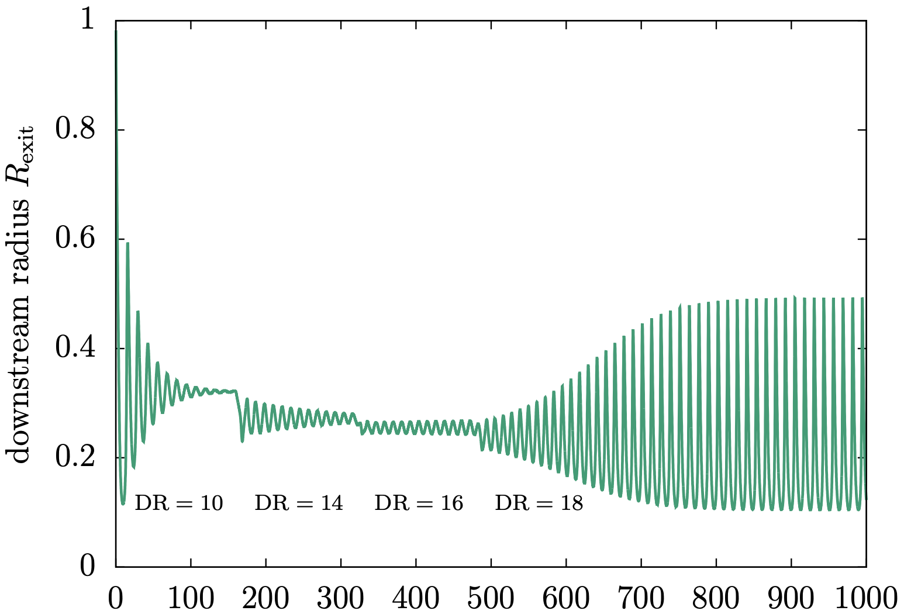

Downstream radius $R_\text{exit}$ is a function of time. Start up with $\DR=10$, at $t=160$ continue with $\DR=14$, at $t=320$ continue with $\DR=16$ and finally at $t=480$ continue with $\DR=18$.
```


`````

[^1]: At the time of writing this chapter does not yet contain sections on interfaces. However, the methods for material boundaries can be applied to material interfaces as well.
