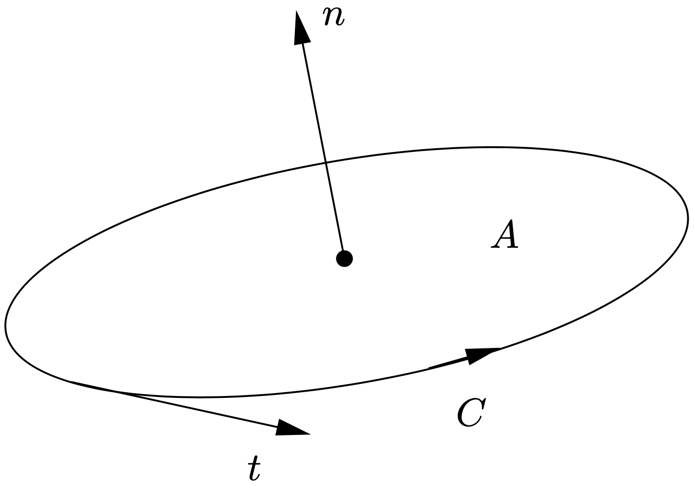
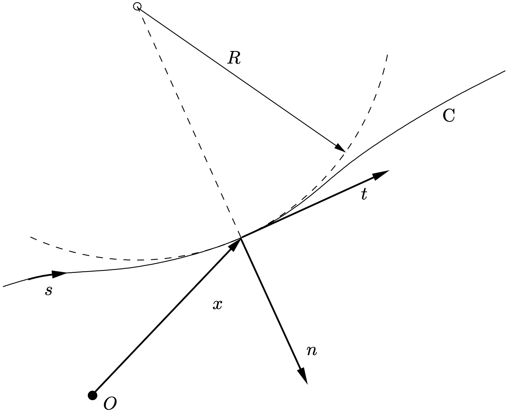

(Appendix)=
# Summary of mathematical notation


In this appendix we give a short summary of the mathematical notation used in these lecture notes. 

## Indices

As a general rule, we try to use subscripts for indices as much as possible. If there are two indices in one symbol with a different meaning, we put the index with the smallest dimension below.  For example, the $i^\text{th}$ directional component (coordinate) of the position of node $k$ will be denoted by $x_i^k$, but the position vector of node $k$ as $\vek x_k$.
 
## Column vectors and matrices

Column vectors will be denoted as a sans serif lower case symbol (e.g., $\col{a}$), and matrices as a sans serif upper case symbol (e.g., $\mat{A}$). Standard notation from linear algebra will be used, for example $\mat{A}\col{u}=\col{f}$ 
for a system of linear equations with formal solution $\col{u}=\mat{A}^{-1}\col{f}$. In addition to the transpose of a matrix $\mat{A}^T$, the transpose of a column vector is defined as $\col{u}^T=(u_1,u_2,\dots,u_N)$, where $N$ is the size of the column vector.

## Vector and tensor notation

We use the dyadic notation of Gibbs for vector and tensors. Sometimes, we also use index notation, which employs the
components of vectors and tensors with respect to a Cartesian co-ordinate system $(x_1,x_2,x_3)$. The (Einstein)
summation convention is used: if an index appears twice a summation must be applied, for example

$$
A_{ij}a_j = \sum_{j=1}^{3} A_{ij}a_j
$$

The index $j$ is called a dummy index. Index $i$, appearing only once, is called a free index. Two special symbols are defined within the index notation:

$$
\begin{array}{l p{0.8\textwidth}}
  \delta_{ij} & \text{Kronecker delta }=
    \begin{cases}
      1 & i=j, \\
      0 & i \neq j
    \end{cases} \\[2ex]
  \varepsilon_{ijk} & \text{Permutation symbol }=
    \begin{cases}
      1 & (i,j,k)=\text{(1,2,3), (3,1,2), (2,3,1)}, \\
     -1 & (i,j,k)=\text{(1,3,2), (2,1,3), (3,2,1)}, \\
      0 & \text{all other cases.}
    \end{cases}
\end{array}
$$


Next, we give a table summarizing vector and tensor notation in both Gibbs notation and index notation (where appropriate):

$$
\begin{array}{@{}l l p{0.62\textwidth}@{}}
\text{Gibbs notation} & \text{Index notation} & \text{Description} \\\hline
\vek a & a_i & \text{vector.} \\
\vek a \cdot \vek b & a_i b_i & \text{inner product of two vectors } \vek a \text{ and } \vek b. \\
|\vek a| & - & \text{length of vector } \vek a. \ \text{Note: } |\vek a|^2 = \vek a \cdot \vek a. \\
\{\vek e_1,\vek e_2,\vek e_3\} & - & \text{set of orthogonal unit basis vectors of a Cartesian co-ordinate system: } 
\ \vek e_i \cdot \vek e_j = \delta_{ij}. \ \text{Note: } \vek a = a_i \vek e_i \ \text{with } a_i = \vek a \cdot \vek e_i. \\
\vek x & x_i & \text{position vector with respect to a fixed origin } \mathcal{O}. \\
\vek a \times \vek b & \varepsilon_{ijk} a_j b_k & \text{cross product of two vectors } \vek a \text{ and } \vek b. \\
\ten A & A_{ij} & \text{(second-order) tensor.} \\
\vek b = \ten A \cdot \vek a & b_i = A_{ij} a_j & \text{mapping of vector } \vek a \text{ to vector } \vek b \text{ using the (second-order) tensor } \ten A.
\end{array}
$$


$$
\begin{array}{@{}l l p{0.62\textwidth}@{}}
\text{Gibbs notation} & \text{Index notation} & \text{Description} \\\hline
\rule{0pt}{2.8ex} 
\vek a \vek b & a_i b_j & \text{dyadic product of two vectors } \vek a \text{ and } \vek b. \ \text{It is a tensor 
defined by the mapping } (\vek a \vek b)\cdot\vek c = \vek a (\vek b\cdot\vek c). \ \text{Note: tensor } \ten A \text{ can be written
using components } A_{ij} \text{ and nine ``unit dyadics'' } \vek e_i \vek e_j \text{ as } \ten A = A_{ij} \vek e_i \vek e_j, \ \text{with } A_{ij} = \vek e_i \cdot (\ten A \cdot \vek e_j). \\
\ten I & \delta_{ij} & \text{unit tensor, i.e.\ } \ten I \cdot \vek a = \vek a. \ \text{Note: } \ten I = \delta_{ij} \vek e_i \vek e_j = \vek e_i \vek e_i. \\
\ten A \cdot \ten B & A_{ik} B_{kj} & \text{product of two tensors } \ten A \text{ and } \ten B, \text{ defined by } (\ten A \cdot \ten B)\cdot \vek a = \ten A \cdot (\ten B \cdot \vek a), \ \text{i.e.\ apply the two mappings in sequence (}\ten B \text{ first). Note: } (\vek a \vek b)\cdot(\vek c \vek d) = \vek a \vek d (\vek b \cdot \vek c). \\
\ten A^m & - & \text{integer power of tensor } \ten A, \ \text{defined as } \ten A^0 = \ten I, \ 
\ten A^m = \ten A \cdot \ten A^{m-1}, \ m=1,2,3,\ldots. \\
\ten A^T & A_{ji} & \text{transpose of tensor } \ten A. \ \text{Note: } (\vek a \vek b)^T = \vek b \vek a, \ (\ten A \cdot \ten B)^T = \ten B^T \cdot \ten A^T. \\
\vek a \cdot \ten A = \ten A^T \cdot \vek a & a_i A_{ij} = A_{ij} a_i & \text{definition of the product of a vector } \vek a \text{ and a tensor } \ten A \ \text{allows omitting parentheses: } \vek a \cdot (\ten A \cdot \vek b) = \vek a \cdot \ten A \cdot \vek b. \\
\tr \ten A & A_{ii} & \text{trace of tensor } \ten A. \ \text{Note: } \tr(\vek a \vek b) = \vek a \cdot \vek b. \\
\det \ten A & - & \text{determinant of tensor } \ten A. \\
\ten A : \ten B & A_{ij} B_{ji} & \text{double inner product of two tensors } \ten A \text{ and } \ten B. \ \text{Note: } \ten A : \ten B = \tr(\ten A \cdot \ten B), \ (\vek a \vek b) : (\vek c \vek d) = (\vek b \cdot \vek c)(\vek a \cdot \vek d). \\
|\ten A| & - & \text{norm of tensor } \ten A, \ \text{defined as } \sqrt{\ten A : \ten A^T}. \\
\ten A\inv & - & \text{inverse of tensor } \ten A, \ \text{defined as the inverse mapping.} \\
\ten A\invT & - & \text{transpose of the inverse of tensor } \ten A. \ \text{Equal to } (\ten A\inv)^T = (\ten A^T)\inv. \\
\plderiv{f}{\ten A} & \plderiv{f}{A_{ij}} & \text{derivative of the function } f(\ten A) \text{ with respect to tensor } \ten A. \ \text{Note: } df = \left(\plderiv{f}{\ten A}\right):d\ten A^T = \left(\plderiv{f}{A_{ij}}\right) dA_{ij}. \\
\end{array}
$$

## Symmetric and skew-symmetric

A tensor $\ten{S}$ is *symmetric* if $\ten S^T=\ten S$ or $S_{ji}=S_{ij}$.
A tensor $\ten W$ is *skew-symmetric* if $\ten W^T=-\ten W$ or $W_{ji}=-W_{ij}$. Any tensor $\ten A$ can be split into a symmetric and a skew-symmetric part 
in the following way

$$
 \ten A=\ten S+\ten W,\quad \text{with}\quad \ten S=(\ten A+\ten A^T)/2
 \quad \text{and}
      \quad\ten W=(\ten A-\ten A^T)/2.
$$

For a symmetric tensor $\ten S$ the following property is very useful:

$$
\ten S:\ten A=\ten S:\ten A^T=\ten S:\big(\tfrac12(\ten A+\ten A^T)\big).
$$

## Invariants

The principal invariants of tensor $\ten A$ are:

$$
I_A=\tr\ten A,
  \quad I\!I_A=\tfrac12(I_A^2-\ten A:\ten A),
  \quad I\!I\!I_A=\det\ten A.
$$ 

The corresponding derivatives with respect to $\ten A$ are:

$$
   \pderiv{I_A}{\ten A}=\ten I, 
   \quad \pderiv{I\!I_A}{\ten A}=(I_A\ten I -\ten A)^T, 
   \quad \pderiv{I\!I\!I_A}{\ten A}=I\!I\!I_A\ten A\invT.
$$

An alternative set of invariants are the moments of $\ten A$:

$$
    \bar{I}(\ten A)= \tr\ten A, \quad
    \bar{I\!I}(\ten A)= \tr\ten A^2, \quad
    \bar{I\!I\!I}(\ten A)=  \tr\ten A^3.
$$ (eq1-A)

The corresponding derivatives with respect to $\ten A$ are:  

$$
      \pderiv{\bar{I}_A}{\ten A}=\ten I, \qquad 
      \pderiv{\bar{I\!I}_A}{\ten A}=2\ten A^T, \qquad
      \pderiv{\bar{I\!I\!I}_A}{\ten A}=3(\ten A^2)^T.
$$ (eq2-A)
   
## Differential operators

Spatial differentiation of field variables is expressed using the nabla operator:

$$
    \nao=\vek e_i\pderiv{}{x_i}. 
$$

The change $d\phi$ over an infinitesimal change in position $d\vek x$ for a scalar field $\phi(\vek x,t)$:

$$
   d\phi = d\vek x\cdot \nao \phi = \nao\phi\cdot d\vek x.
$$

In index notation, we write

$$
   d\phi = \pderiv{\phi}{x_i}dx_i=\phi_{,i}\,dx_i
$$

where we introduced the short hand notation $\phi_{,i}=\plderiv{\phi}{x_i}$. For a vector field $\vek v(\vek x,t)$:

$$
\begin{align*}
    d\vek v&=d\vek x\cdot \nao \vek v=(\nao\vek v)^T\cdot d\vek x,\\
    dv_i&= \pderiv{v_i}{x_j}dx_j=v_{i,j}\,dx_j.
\end{align*}
$$

In general, 

$$
    d\psi=d\vek x\cdot \nao \psi=\psi_{,i}\,dx_i
$$

where $\psi(\vek x,t)$ can be a scalar, vector 
 or tensor field. Next, we give a table summarizing various
differential operations in both Gibbs notation and index notation for
 a scalar field $\phi(\vek x,t)$, vector field $\vek v(\vek x,t)$
 and tensor field $\ten\Sigma(\vek x,t)$:

 $$
\begin{array}{@{}l l p{0.615\textwidth}@{}}
\text{Gibbs notation} & \text{Index notation} & \text{Description} \\\hline
\rule{0pt}{2.3ex} \nao \phi & \phi_{,i} & \text{gradient of scalar field } \phi(\vek x,t). \\
\nao \vek v & v_{j,i} & \text{gradient of vector field } \vek v(\vek x,t). \\
(\nao \vek v)^T & v_{i,j} & \text{transpose of the gradient of vector field } \vek v(\vek x,t). \\
\nao \cdot \vek v & v_{i,i} & \text{divergence of vector field } \vek v(\vek x,t). \\
\nao \cdot \ten \Sigma & \Sigma_{ji,j} & \text{divergence of tensor field } \vek \Sigma(\vek x,t). \\
\nao \cdot \ten \Sigma^T & \Sigma_{ij,j} & \text{divergence of the transpose of tensor field } \vek \Sigma(\vek x,t). \\
\nao \times \vek v & \varepsilon_{ijk} v_{k,j} & \text{curl of vector field } \vek v(\vek x,t). \\
\nabla^2 \phi & \phi_{,ii} & \text{Laplacian of scalar field } \phi(\vek x,t). \ \text{Note: } \nabla^2 \phi = \nao \cdot (\nao \phi). \\
\nabla^2 \vek v & v_{i,jj} & \text{Laplacian of vector field } \vek v(\vek x,t). \ \text{Note: } \nabla^2 \vek v = \nao \cdot (\nao \vek v). \\
\end{array}
$$

Some useful identities involving $\nao$:

$$
   \begin{gather*}
       \nao\cdot(\phi\vek v)=(\nao \phi)\cdot\vek v+ \phi\nao\cdot\vek v, \label{eq:Aeq1} \\
      \nao\cdot(\vek v\vek w)=(\nao\cdot\vek v)\vek w+\vek v\cdot\nao\vek w, \label{eq:Aeq2}\\
       \nao\cdot(\vek z\vek v\cdot\vek w)=(\nao\cdot\vek z)\vek v\cdot\vek w+\vek z\cdot\nao\vek v\cdot\vek w+\vek z\cdot\nao\vek w\cdot\vek v
       , \label{eq:Aeq2a}\\
       \nao(\phi\vek v)=(\nao \phi)\vek v + \phi\nao\vek v, \label{eq:Aeq3}\\
      \nao\times(\vek v\times\vek w) =(\nao\cdot\vek w)\vek v
           +\vek w\cdot\nao\vek v-(\nao\cdot\vek v)\vek w
           -\vek v\cdot\nao\vek w,\label{eq:Aeq4}\\
      \vek v\times(\nao\times\vek v)=\nao(\tfrac12 v^2)-\vek v\cdot\nao\vek v,\label{eq:Aeq5}\\
      \nao\cdot(\nao\times\vek v)=0,\label{eq:Aeq6}\\ 
      \nao\times(\nao\phi)=\vek 0,\label{eq:Aeq7}\\
       \nao\cdot(\ten \Sigma\cdot\vek v)=(\nao\cdot \ten \Sigma)\cdot\vek v+\ten \Sigma:(\nao\vek v)^T,
       \label{eq:Aeq8}\\
       \nao\cdot(\nao\vek v)^T=\nao(\nao\cdot\vek v).\label{eq:Aeq9}
   \end{gather*}
$$ (eq3-A)

where $v=|\vek v|$.

## Integral theorems

The *divergence theorem* or *Gauss's theorem* applied to vector field $\vek v(\vek x,t)$ and tensor field $\ten\Sigma(\vek x,t)$: 
for a closed region $V$ bounded by a surface $A$, we have

$$
   \begin{align*}
      \int_V \nao\cdot\vek v\,dV &= \int_A\vek n\cdot\vek v\,dA,\\
      \int_V \nao\cdot\ten\Sigma\,dV &= \int_A\vek n\cdot\ten\Sigma\,dA,
   \end{align*}
$$ (eq4-A)

where $\vek n$ is the outwardly directed unit normal vector on surface $A$. 

*Stokes's theorem*: for an open surface $A$ bounded by a closed curve $C$, we have

$$
   \oint_C \vek v\cdot\,\vek t\,ds=\int_A(\nao\times\vek v)\cdot\vek n\,dA,
$$ (eq5-A)

where $\vek t$ is the tangential vector and $\vek n$ is the normal vector of the surface $A$, both corresponding to the direction of the line integral according to {numref}`fig1-appendix` (right-handrule for the direction of $\vek n$.).

```{figure-md} fig1-appendix



Direction of the tangential vector $\vek t$ and normal vector $\vek n$, both corresponding to the direction of the closed curve $C$ in Stokes's theorem.
```

## Differential geometry

For a summary of this subject see Appendix A of {cite}`Dantzig2001` and for a more extensive treatment see {cite}`Struik1988`.

## Curves in 2D

Elementary differential geometry of a curve C in 2D given by $\vek x=\vek x(s)$, where $s$ is the arc length along the curve (see {numref}`fig2-appendix`):

$$
 \vek t=\deriv{\vek x}s,\qquad \deriv{\vek t}s=-\kappa\vek n,\qquad\kappa=\frac1R=-\vek n\cdot\deriv{\vek t}s=\vek t\cdot\deriv{\vek n}s
$$ (eq6-A)

where $\vek t$ is the unit tangential vector, $\vek n$ the unit normal vector, $R$ the radius of curvature and $\kappa$ the curvature. Note, that the sign of the curvature and the direction of the normal vector are ambiguous. We have chosen here: curvature is positive to the “left” and the normal vector is directing to the “right”, as seen from “walking along the curve” with $s$ increasing[^1].

```{figure-md} fig2-appendix



Curve C, given by $\vek x=\vek x(s)$, with unit tangential vector $\vek t$, unit normal vector $\vek n$ and radius of curvature $R$.
```


[^1]: In {cite}`Dantzig2001` the sign of the curvature is the same, but the normal is defined pointing to the “left”.